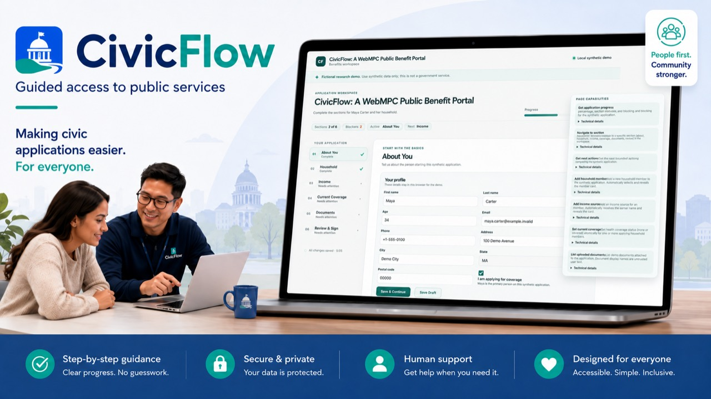

# CivicFlow: A WebMPC Public Benefit Portal

<p align="center">
  
</p>

<p align="center"><em>Promotional overview. The live product remains a synthetic research demo, not a government service.</em></p>

<p align="center">
  <a href="https://civicflow.codesm.chatgpt.site/">Live app</a> ·
  <a href="https://youtu.be/OoCD4bAo9EA">2:19 demo video</a> ·
  <a href="https://github.com/subhav13/CivicFlow">Public source</a> ·
  <a href="LICENSE">MIT license</a>
</p>

CivicFlow is a synthetic public-benefits workflow where a person and a browser
agent work on the same visible application state. WebMCP exposes bounded,
typed actions instead of making the agent guess at labels or click order. The
optional voice companion uses that same tool surface and asks for visible
confirmation before it applies a change.

The product name intentionally uses **WebMPC**; the browser capability used by
the implementation and challenge is **WebMCP**. CivicFlow is not an eligibility
engine, government service, or enrollment submission.

## Judge it in 90 seconds

1. Open the [live app](https://civicflow.codesm.chatgpt.site/) in ChatGPT's
   in-app browser, or use Chrome 149+ with WebMCP testing enabled.
2. Open the floating **Agent Companion** and expand **Activity & tools**. The
   page initially exposes seven static tools; contextual tools appear when the
   selected section or record makes them relevant.
3. Ask by voice or chat, “What is left in this application?” Then request one
   bounded change and use **Save change** to approve it.
4. Watch the application and activity entry update together. The same workflow
   remains fully usable through the manual form.
5. See the complete flow in the [2:19 demo video](https://youtu.be/OoCD4bAo9EA).

## What the demo shows

The useful unit is one shared workflow rather than a chat bolted onto a form:

```text
person in the portal ───────────────┐
browser agent through WebMCP ──────┼─ commands/store ─ visible UI
optional Gemini Live companion ────┘

human-only Submit Demo ─ local fictional completion
```

The human sees the application sections, selections, activity, operation
progress, validation messages, and effects. An agent can use the same current
state through structured tools instead of guessing at labels or click order.
Mutation inputs are schema-validated. The Gemini companion presents a visible
button-only confirmation before it applies a mutation; it cannot submit or
attest the application.

## Live judge path

| Artifact          | Link                                     |
| ----------------- | ---------------------------------------- |
| Live portal       | <https://civicflow.codesm.chatgpt.site/> |
| Public demo video | <https://youtu.be/OoCD4bAo9EA>           |
| Public source     | <https://github.com/subhav13/CivicFlow>  |
| License           | [MIT](LICENSE)                           |

The deployed portal was tested after the final naming and companion-state
release. WebMCP is optional for the human portal: when the capability or voice
provider is unavailable, the regular labelled form remains the manual
fallback. Use synthetic information only.

## WebMCP surface

The source catalog defines exactly ten names in `src/webmcp/tool-catalog.ts`.
At runtime, a discovery starts with the seven static tools; only contextual
tools applicable to the current section or selected record are registered at
that moment. Selecting or opening the relevant context reveals the remaining
contextual tools. All registrations use `execute` handlers through the browser
adapter in `src/webmcp/browser-model-context-port.ts`.

| Tool                       | Surface    | Role                                          |
| -------------------------- | ---------- | --------------------------------------------- |
| `get_application_progress` | static     | Read completion percentage and section status |
| `navigate_to_section`      | static     | Navigate the visible workspace                |
| `get_next_actions`         | static     | Read the next bounded application actions     |
| `add_household_member`     | static     | Add a synthetic household member              |
| `update_household_member`  | contextual | Update the selected household member          |
| `add_income_source`        | static     | Add a synthetic income source                 |
| `update_income_source`     | contextual | Update the selected income source             |
| `set_current_coverage`     | static     | Set synthetic current-coverage records        |
| `list_uploaded_documents`  | static     | Read demo document metadata and readiness     |
| `review_application`       | contextual | Review the active Review & Sign section       |

The three contextual tools are not hidden alternate commands. Their
availability follows visible state: selecting a household member enables
`update_household_member`, selecting an income source enables
`update_income_source`, and opening Review & Sign enables
`review_application`. The registry manager registers and unregisters those
tools as the context changes.

There is no WebMCP `submit_application` or attestation tool. The visible
**Submit Demo** control is deliberately human-only and fictional.

## Local setup

Use a current Node.js/npm installation compatible with the checked-in
`package-lock.json`.

```bash
npm ci
npm run dev
```

The Vite development server defaults to `http://localhost:5173`. The local
portal does not require WebMCP or Gemini. For browser-agent testing, use a
WebMCP-capable browser as described above.

### Optional local Gemini configuration

`.env.example` documents the current variables. Copy it to a local env file
only when you have separately authorized a local voice audit; keep the
credential blank until that audit is authorized.

```text
GEMINI_API_KEY=
CIVICFLOW_LIVE_AUDIT=0
VITE_CIVICFLOW_LIVE_AUDIT=0
CIVICFLOW_VOICE_ENABLED=0
VITE_CIVICFLOW_VOICE_ENABLED=0
CIVICFLOW_ALLOWED_ORIGINS=http://localhost:5173
CIVICFLOW_LIVE_ORIGIN=http://localhost:5173
```

`GEMINI_API_KEY` is server-only. It must never be placed in a `VITE_*`
variable, committed, copied into documentation, or exposed in the browser
bundle. The local audit and voice gates are off by default. The hosted Worker
uses `CIVICFLOW_VOICE_ENABLED=1` only with a non-empty allowlisted origin; it
does not honor the local audit bypass.

### Build and verification

The package scripts are the source of truth for local gates:

```bash
npm run format:check
npm run lint
npm run scan:secrets
npm run typecheck
npm run test:unit
npm run test:contract
npm run build
npm run test:e2e
npm run verify
```

`npm run build` creates the Vite client and the Worker-compatible server
artifact through `scripts/write-site-worker.mjs`; it does not save or deploy a
Site. `npm run verify` is the aggregate local gate. A clean-install candidate
must also run `git diff --check` and inspect `git status --short --branch`.
Exact Phase 5 candidate results are recorded in
[`docs/release/civicflow-release-evidence.md`](docs/release/civicflow-release-evidence.md).

## Runtime and hosting boundaries

- `src/application/*` owns the local application state and command receipts.
- `src/webmcp/*` owns tool schemas, registration, validation, execution, and
  contextual availability.
- `src/assistant/*` owns the optional Gemini transport, current tool-surface
  mapping, confirmation, and media lifecycle.
- `server/sites-worker.ts` routes `/api/gemini/session` before the SPA asset
  fallback. `server/gemini-*` issues a constrained ephemeral session using a
  server-only credential.
- `.openai/hosting.json` identifies the ChatGPT Sites project used by the
  accepted deployment. Saving or deploying a new version is an owner action,
  not part of this documentation candidate.

The hosted session route returns JSON with `Cache-Control: no-store`, checks
the request origin and method, limits the request body and session rate, and
returns only an ephemeral access token and expiry. The provider credential is
not part of the client contract.

Gemini is optional. The production client gate is explicit and defaults off;
the public Site evidence above records the previously accepted v10 gate. This
package does not make a new live provider call or change hosted settings. If
voice is unavailable, the text/manual WebMCP path remains the demonstrated
fallback.

## Privacy and security

Use synthetic values only. The deterministic seed includes clearly fictional
values such as `maya.carter@example.invalid`, `+1-555-0100`, `100 Demo Avenue`,
and `Demo City`; do not replace them with real applicant information.

The application stores its validated local application state in browser
`localStorage` under `civicflow.application.v1`. Reset restores the synthetic
seed. There is no account, authentication, cross-device state, fingerprinting,
or custom visitor identity. This release adds no transcript store, custom
product-event analytics client, analytics route, or D1 schema. Any Sites
platform visitor/page-view analytics is outside the portal's application data
model and is not a claim about custom analytics.

When optional Gemini is enabled, microphone/text traffic follows the configured
Gemini Live path. Keep the interaction synthetic and review the provider's
current terms separately. The portal's server keeps `GEMINI_API_KEY` out of the
browser; never paste a credential into an issue, screenshot, video, or this
repository.

## Accessibility and manual fallback

The portal uses labelled controls, section headings, keyboard-operable buttons,
status/live regions for operation feedback, and a focused reset confirmation
dialog. The assistant confirmation uses explicit buttons: **Save change**,
**Need correction**, and **Cancel**. The manual form path is always
available when WebMCP or voice is unavailable. The accepted local accessibility,
responsive, reduced-motion, confirmation, and no-submit checks are listed in
the release evidence and prior phase ledgers.

## Limitations and deferred work

This release intentionally does not provide:

- government integration, official program rules, eligibility determination,
  benefits advice, real enrollment, or an external submission;
- real file upload, document bytes, OCR, classification, or document
  transmission;
- authentication, account identity, cross-device synchronization, or a
  remote application database;
- agent submission or attestation tools;
- custom product analytics, D1, a dashboard, or persistent visitor identity;
- a provider fallback or a guarantee of Gemini quota, model availability, or
  unverified provider behavior.

Phase 4C custom analytics/D1 is explicitly deferred. The synthetic document
readiness view mirrors only the demo's internal completeness rule; it is not a
government document requirement or eligibility signal.

## Challenge judging map

The mapping below is an evidence-backed rehearsal guide, not an acceptance
decision.

| Criterion             | CivicFlow: A WebMPC Public Benefit Portal evidence to inspect                                                                                                                                                               |
| --------------------- | --------------------------------------------------------------------------------------------------------------------------------------------------------------------------------------------------------------------------- |
| WebMCP Leverage       | A ten-name typed catalog (seven static plus applicable contextual tools), `document.modelContext.registerTool` through the browser adapter, contextual registration, command/store execution, and visible activity/progress |
| Execution             | Six-section human workflow, deterministic synthetic seed, validation/recovery, local setup/build/test gates, public Site, and a 2:19 walkthrough                                                                            |
| Potential Impact      | A bounded example of people and agents coordinating structured application work without making policy or eligibility claims                                                                                                 |
| Creativity & Ambition | Shared human/agent state plus optional Gemini Live companion and contextual capabilities, with a clear human-only submission boundary                                                                                       |

The official submission description must answer why the use case fits WebMCP,
how the experience improves, what people and agents do together, and how
WebMCP was implemented. A draft is prepared at
[`docs/release/civicflow-devpost-draft.md`](docs/release/civicflow-devpost-draft.md).

## Release and submission status

The live portal, public GitHub repository, root MIT license, and public 2:19
YouTube demo are ready for judging. GitHub's `main` and `release` branches are
kept at the same final submission commit. The complete copy-ready Devpost form
draft is in
[`docs/release/civicflow-devpost-draft.md`](docs/release/civicflow-devpost-draft.md).

The Devpost form itself is intentionally a manual owner action. After the
deadline, the repository, video, live Site, and submission should remain
unchanged through the judging period unless the challenge organizers instruct
otherwise.
